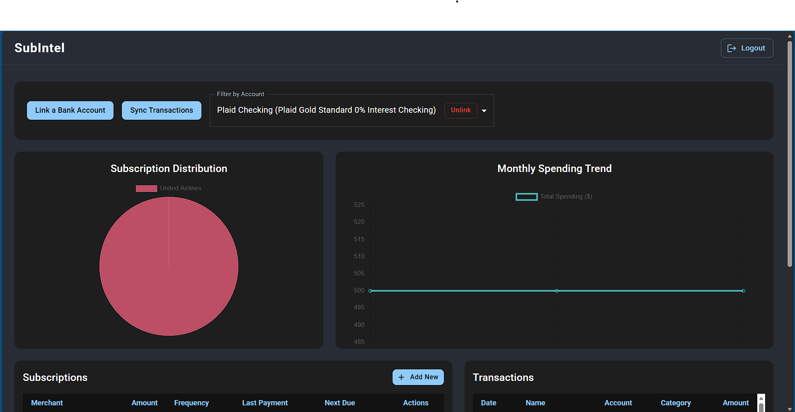
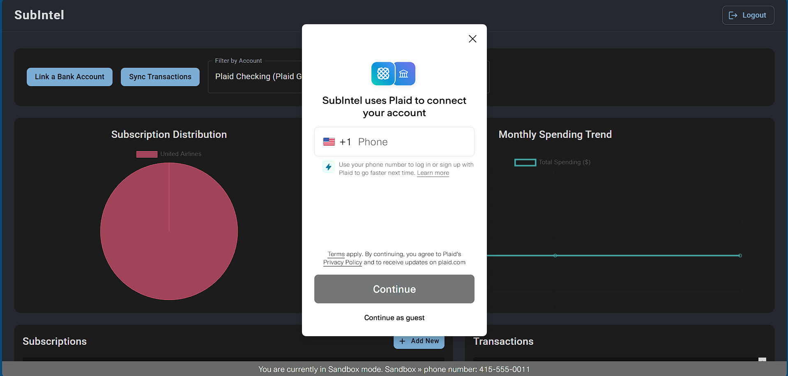
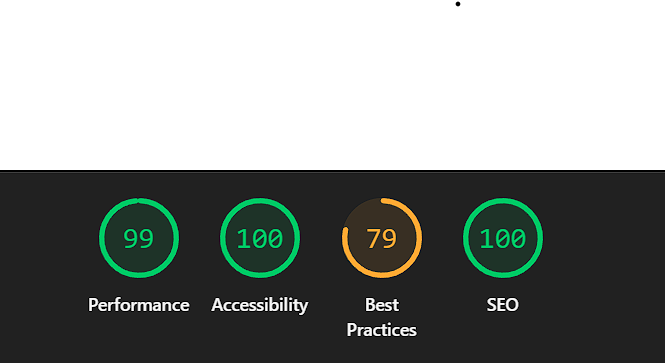
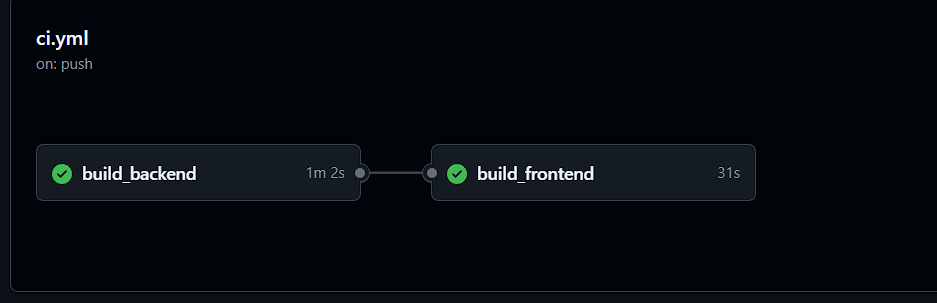

# SubIntel - Intelligent Subscription Management Platform
**SubIntel** is a full-stack financial analytics dashboard designed to help users track recurring expenses, detect forgotten subscriptions, and visualize spending habits.

🔗 **Live Demo:** http://23.23.239.163:3000
*(Note: The app runs in Plaid Sandbox mode. Use Username: `user_good` / Password: `pass_good` / Code: `123456` to link a bank account.)*

---

## Key Features

* **Bank Integration:** Securely link multiple bank accounts using the **Plaid API**.
* **Smart Detection Algorithm:** A custom Java algorithm analyzes raw transaction data to automatically identify weekly, monthly, and yearly recurring payments.
* **Automated Insights:**
    * **Email Alerts:** Daily background jobs (`@Scheduled`) notify users of upcoming bills via Gmail SMTP.
    * **Auto-Cancellation:** Automatically flags subscriptions as "Inactive" if payments stop appearing.
* **Data Visualization:** Interactive charts (Pie & Line) to track spending distribution and monthly trends using **Chart.js**.
* **Secure Authentication:** Stateless JWT-based auth with Spring Security and HttpOnly practices.

## Tech Stack

### Backend (Java Spring Boot)
* **Core:** Spring Boot 3.5, Java 25
* **Security:** Spring Security, JWT (JSON Web Tokens), BCrypt
* **Database:** PostgreSQL (AWS RDS), Spring Data JPA, Hibernate
* **Testing:** JUnit 5, Mockito, Testcontainers
* **Monitoring:** Spring Boot Actuator, AWS CloudWatch

### Frontend (React)
* **Core:** React 19, TypeScript, Vite
* **UI/UX:** Material UI (MUI) v7, Dark Mode Theme
* **State/Routing:** React Router v7
* **Testing:** Vitest, React Testing Library

### DevOps & Cloud
* **Containerization:** Docker, Docker Compose (Multi-stage builds)
* **CI/CD:** GitHub Actions (Automated Testing -> Build -> Docker Hub Push -> AWS Deploy)
* **Cloud Provider:** AWS (EC2 for App, RDS for Database, CloudWatch for Logs)
* **Web Server:** Nginx (Reverse Proxy & Gzip Compression)

---

## System Architecture

The application follows a microservice-ready, layered architecture:
1.  **Client:** React app served via Nginx container.
2.  **API Layer:** Spring Boot REST Controller with DTO mapping.
3.  **Service Layer:** Business logic for Plaid sync, subscription detection, and scheduling.
4.  **Data Layer:** AWS RDS (PostgreSQL) for persistent storage.

---

## Screenshots

| **Dashboard Overview** | **Bank Integration (Plaid)** |
|:---:|:---:|
|  |  |
| *Real-time insights into subscriptions and spending.* | *Securely link bank accounts using Plaid.* |

| **Performance (Lighthouse)** | **Automated CI/CD** |
|:---:|:---:|
|  |  |
| *Optimized for 99/100 Performance & Accessibility.* | *Automated testing and deployment pipeline.* |

## Running Locally

**Prerequisites:** Docker Desktop installed.

1.  **Clone the repo**
    ```bash
    git clone https://github.com/Deeppatel911/SubIntel.git
    cd SubIntel
    ```

2.  **Configure Environment**
    Create a `.env` file in the root directory:
    ```properties
    JWT_SECRET_KEY=your_secret
    PLAID_CLIENT_ID=your_plaid_id
    PLAID_SECRET_SANDBOX=your_plaid_secret
    PLAID_ENV=sandbox
    FRONTEND_URL=http://localhost:3000
    # ... (Add DB credentials if running local DB)
    ```

3.  **Run with Docker Compose**
    ```bash
    docker compose up --build
    ```
    The app will be available at `http://localhost:3000`.

---

## Testing

The project maintains high code quality via automated testing:
* **Backend:** `mvn test` runs Unit tests (Service layer) and Integration tests (Repository layer using Testcontainers).
* **Frontend:** `npm test` runs Component tests using Vitest.